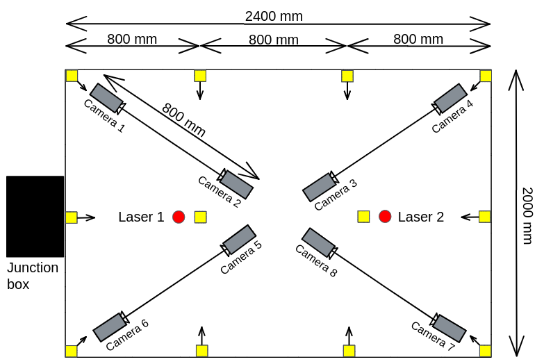
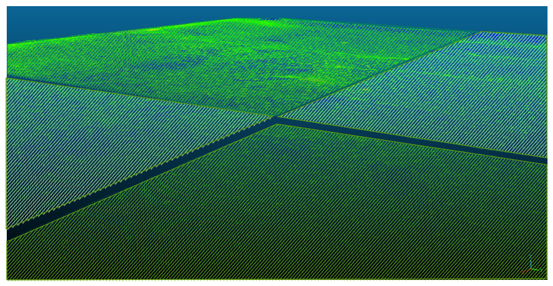
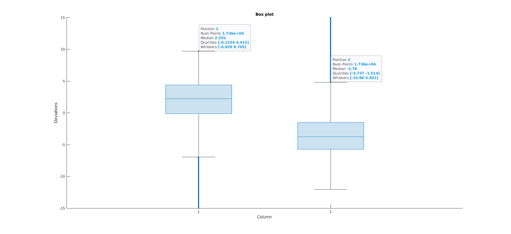
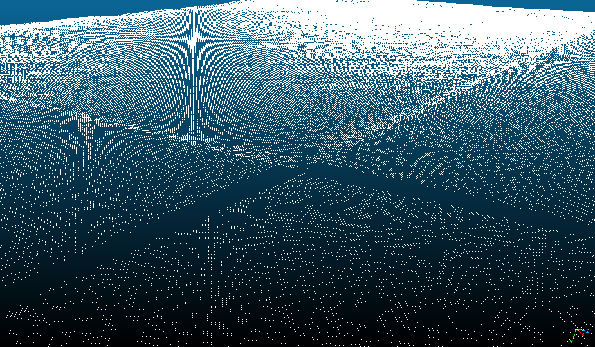

# P6_IndustrialCameraCalib

AAU Robotics BSc, P6: Calibrating an industrial four stereo camera system to a common reference frame
=====================================================================================================

## Objectives
+ Learn how to perform extrinsic calibration using 3D data
+ Learn to assess the performance of a stereo camera
+ Apply computer vision techniques to detect important features of a calibration object

## Project description
The purpose of an industrial vision system, see Figure 1, consisting four stereo pairs, is to capture a large object and 3D reconstruct it. Each stereo pair provides a cloud representing approx. a fourth of the measured area. The problem is that these clouds do not have a common reference frame. As a consequence, the merged cloud resulting from the clouds coming from each stereo pair is not a correct, seamless cloud, see Figure 2. The goal of the project is to develop a calibration method that can solve this problem. 

This project is split in two main parts. First, detection and analysis of the noise level on X, Y,and Z axes for each stereo pair, to find how much each camera performance affects the extrinsic calibration. Second, the process of designing a calibration object and a calibration method. The method chosen to calibrate is by detecting control points of the calibration object, by using two measuring systems: the one to correct, and another one with high measuring accuracy. The transformation between the two control point sets is found, and used to correct the extrinsic calibration of the industrial vision system.

  
Fig 1: Industrial vision system layout

  
Fig 2: Current solution of the measured area

**Used tools:** Python, MATLAB, Cloud Compare, Open3D

**Used hardware:** Scorpiom 3D Stinger Monochrome cameras, Random Pattern Projection (RPP) lasers, MetraSCAN 3D measuring tool, laser cutter to design the calibration object

**Folder & file description:**
+ `Python/x_y_noise.py` uses 100 measurements of the same scene, the scene contains a machined steel object. The corners of the steel plate are determined. 
+ `MATLAB/multivariate_normal_dist_xy_noise` takes the results from the previous step and calculates the standard deviation between the measurements, and other data analysis. 
+ `Python/z_noise_fat_obj.py` takes one measurement of the steel plate and splits the cloud into 50 x 50 mm cells. 
+ `MATLAB/noise_z_solution` fits a plane to each cell, projects the data points onto the plane and calculates the deviations. 
+ `Python/extrinsic_calib.py`detects control points of the calibration object, computes the transformation and applies it to the industrial vision system data to bring it in the same reference frame.
+ `MATLAB/testing` fits a plane to the merged clouds from the current solution and the proposed solution by this project. The deviations are calculated and compared using box plotting.

## Result

  
Fig 3: Overview of the deviations for both solutions in the shape of a box plot: Column 1) proposed solution, Column 2) current solution

|                  | Proposed solution [mm] | Current solution [mm] |
|:----------------:|:----------------------:|:---------------------:|
|  Median          |          2.201         |         -3.78         |
|  Quartile 1      |         -0.1234        |         -5.737        |
|  Quartile 2      |          4.413         |         -1.514        |
|  Whisker 1 (min) |         -6.929         |         -12.06        |
|  Whisker 2 (max) |          9.705         |         4.821         |
| Nr. outliers     |        8.567e+04       |       8.118e+04       |  
Tab 1: The five number summary of the two sets of calibrated merged point cloud data using the box plot method

  
Fig 4: Proposed solution of the measured area
